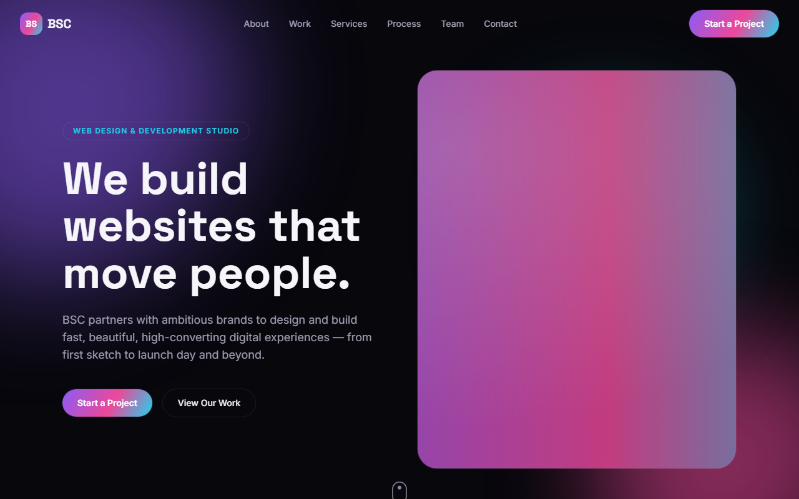

# BSC — Web Design & Development Studio

A single-page marketing site for a (fictional) web-design & development studio, built as a front-end and scroll-animation showcase.

**[Live demo](https://motion-studio-landing-t-dev.vercel.app/)** · **[Report a bug](https://github.com/TareqZiedan/motion-studio-landing/issues)**



---

## Overview
BSC is a static, single-page studio landing site — hero, services, portfolio, process, stats, testimonials and team, stitched together as one scrolling experience. It's a front-end/animation project: there is no backend, and every piece of copy, project, testimonial and team member lives as typed data in `src/data/content.ts`. It exists to exercise GSAP-driven scroll animation (SplitText headings, scroll-reveal sections, a scrubbed parallax hero, animated stat counters) inside the Next.js 16 App Router with React 19.

---

## Accessibility

Accessibility is treated as part of "done" here, not a later pass — and on a
motion-first site the headline concern is respecting reduced motion. Concretely:

- **Reduced motion is respected site-wide.** Every GSAP animation is gated behind a
  `prefersReducedMotion()` check (`src/lib/gsap.ts`). Under
  `prefers-reduced-motion: reduce`, reveal / parallax / marquee / count-up animations
  don't run and content renders in its final, visible state — with the tricky cases
  handled explicitly: the pinned scroll-scrub **showcase becomes a plain vertical stack**
  (so every project stays reachable), the **stat counters show their final value**
  instead of "0", and the mobile menu opens and closes instantly. A CSS
  `@media (prefers-reduced-motion: reduce)` block neutralizes the remaining SCSS-driven
  effects and smooth scrolling (`src/app/globals.css`).
- **A skip link.** A "Skip to main content" link is the first focusable element;
  visually hidden until focused, it jumps past the navbar to `<main id="main-content">`
  (`src/app/layout.tsx`).
- **Semantic landmarks.** A `<header>` banner (the navbar) containing a labelled
  `<nav aria-label="Main navigation">`, a single focusable `<main id="main-content">`,
  and a `<footer>`.
- **Labelled controls.** The mobile-menu toggle, the testimonial prev/next and dot
  controls, the footer social links and the newsletter subscribe button all carry
  descriptive `aria-label`s.
- **Meaningful image alternatives.** Content images (team, workspace, project
  thumbnails, avatars) have descriptive `alt` text; purely decorative background art
  uses `alt=""` so screen readers skip it.

Verified with a Chromium pass in both modes: the keyboard skip link works, and under
reduced motion no section is left hidden, counters show their final values, and every
showcase panel is visible.

---

## Tech stack

| Layer | Choice | Why |
| --- | --- | --- |
| Framework | Next.js 16.2 (App Router, Turbopack) | Static-prerendered single page (`build` output marks `/` as `○ Static`); `next/font` and `next/image` used throughout |
| Language | TypeScript 5 | Content is modelled as typed data (`NavLink`, `Service`, `Testimonial`, … in `src/data/content.ts`) |
| UI library | React 19.2 | Required by Next.js 16; `useGSAP` runs client-side under the App Router |
| Animation | GSAP 3.15 + `@gsap/react` (`useGSAP`), ScrollTrigger, SplitText | Scroll-reveal, scrubbed parallax, and split-text heading animation; `useGSAP` scopes and auto-cleans animations |
| Styling | Tailwind CSS v4 (`@tailwindcss/postcss`) + SCSS Modules (Sass) | Tailwind utilities for layout; component-scoped `.module.scss` for bespoke effects (blobs, clip-path menu, navbar) |
| Fonts | `next/font/google` (Space Grotesk, Inter) | Self-hosted display + body fonts, no layout shift |
| Deploy | Vercel | Production deployment at the live-demo URL above |

---

## Features
- **Animated hero** — heading animates in word-by-word via GSAP SplitText, with a scroll-scrubbed parallax on the hero image.
- **Scroll-reveal sections** — content fades and rises into view as you scroll, driven by a reusable `useScrollReveal` hook + ScrollTrigger.
- **Work showcase & project grid** — browse featured case studies and a wider portfolio grid.
- **Services & process** — read the studio's six service offerings and its four-step engagement process.
- **Animated stat counters** — key numbers (projects, clients, years) count up when the fun-fact section enters the viewport.
- **Testimonials with star ratings** — client quotes with per-testimonial star ratings.
- **Team grid & marquee** — meet the team, plus a continuously scrolling keyword marquee.
- **Responsive nav with animated mobile menu** — sticky navbar that restyles on scroll, and a full-screen clip-path "circle reveal" menu on mobile.
- **Reduced-motion aware** — every animation is gated on `prefers-reduced-motion`, so reduced-motion users get a still, fully readable page (see [Accessibility](#accessibility)).

---

## Running locally

**Requirements:** Node 20.9+ (see `engines` in package.json), npm

```bash
git clone https://github.com/TareqZiedan/motion-studio-landing.git
cd motion-studio-landing
npm install
npm run dev
```

Open [http://localhost:3000](http://localhost:3000). No environment file or API keys are needed.

### Environment variables

This project reads **no environment variables** — there is no `.env.example` and no `process.env` usage in the source. It runs with zero configuration.

### Scripts

| Command | Does |
| --- | --- |
| `npm run dev` | Start the Next.js dev server |
| `npm run build` | Production build (Turbopack) |
| `npm run start` | Serve the production build |
| `npm run lint` | Run ESLint (`eslint-config-next`) |

---

## Project structure

```
src/
├── app/                  # App Router entry: layout.tsx, page.tsx, globals.css
├── components/
│   ├── layout/           # Navbar, Footer (with .module.scss)
│   ├── sections/         # Page sections: Hero, About, Showcase, Service, Testimonial, Team, …
│   └── ui/               # Reusable bits: Counter, Marquee, StarRating, GradientButton, SectionHeading
├── hooks/                # useScrollReveal — shared GSAP scroll-reveal hook
├── lib/                  # gsap.ts — client-only GSAP registration + prefersReducedMotion()
├── data/                 # content.ts — all site copy/data as typed constants
└── styles/               # _variables.scss, _mixins.scss — shared Sass
public/
└── images/               # Placeholder SVG art (hero, projects, team, testimonials, …)
```

---

## What I'd do differently
- **Real assets over placeholders.** All imagery is generated placeholder SVGs, not final design work.
- **Move content out of the bundle.** Everything in `src/data/content.ts` is hardcoded; a CMS or MDX source would make it editable without a redeploy.
- **The contact CTA goes nowhere.** "Start a Project" links to the `#contact` anchor only — there's no form or backend to actually receive a lead.
- **No tests, no CI.** There is no test suite and no CI workflow; a smoke test and a lint/build check on PRs would guard against regressions.

---

## License
MIT — see [LICENSE](./LICENSE).
